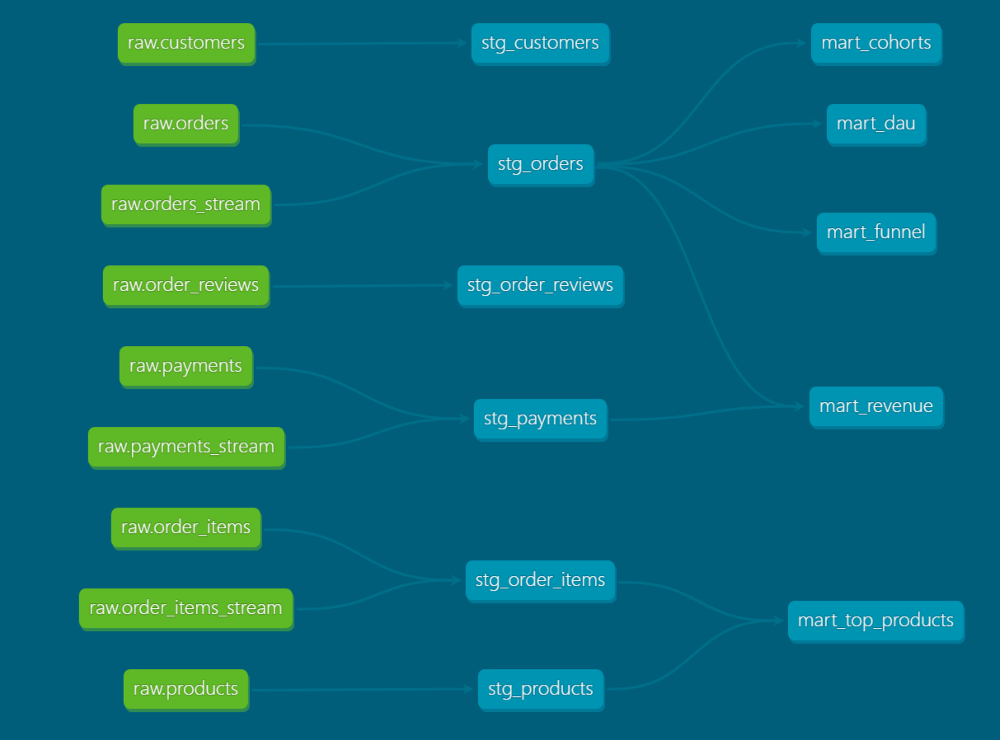

# Olist E-Commerce Analytics

Аналитический DWH на основе публичного датасета бразильского маркетплейса Olist.

## Стек
- **ClickHouse** — аналитическая база данных
- **dbt** — трансформации и тестирование данных
- **Apache Kafka** — потоковая передача данных *(в разработке)*
- **PySpark** — обработка стрима *(в разработке)*
- **Docker** — контейнеризация окружения
- **Python** — загрузка сырых данных

## Архитектура
```
raw (CSV → ClickHouse)
    ↓
staging (очистка, типизация, переименование)
    ↓
marts (бизнес-метрики)
```

[Lineage Graph]


## Витрины

| Витрина | Описание |
|---|---|
| mart_revenue | Ежемесячная выручка, средний чек, ARPU |
| mart_dau | Ежедневная активность покупателей |
| mart_cohorts | Когортный анализ и retention |
| mart_funnel | Воронка заказов по этапам |
| mart_top_products | Топ категорий товаров по выручке |

## Быстрый старт

1. Клонировать репозиторий
```bash
   git clone https://github.com/kiritango/olist-analytics.git
   cd olist-analytics
```

2. Создать .env из шаблона
```bash
   cp .env.example .env
```

3. Поднять окружение
```bash
   docker-compose up -d
```

4. Установить зависимости
```bash
   python -m venv .venv
   .venv\Scripts\activate
   pip install -r requirements.txt
```

5. Загрузить данные
```bash
   python scripts/init_db.py
   python scripts/init_tables.py
   python scripts/load_raw.py
```

6. Запустить dbt
```bash
   cd olist_dbt
   dbt run
   dbt test
```